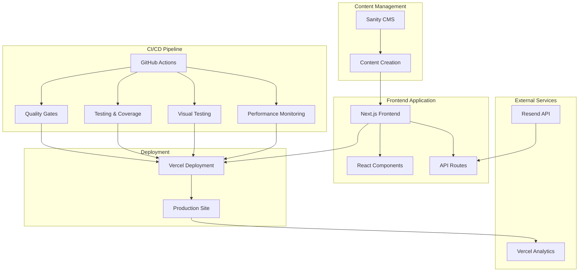

# 🎯 Leenders Coaching

<div align="center">

[](https://codecov.io/gh/bartwaardenburg/leenders-coaching)
[](https://nextjs.org/)
[](https://sanity.io/)
[](https://tailwindcss.com/)
[](https://www.typescriptlang.org/)

_A modern, high-performance coaching website built with cutting-edge web technologies_

<!-- CI/CD Status -->

[](https://github.com/bartwaardenburg/leenders-coaching/actions/workflows/quality-gates.yml)
[](https://github.com/bartwaardenburg/leenders-coaching/actions/workflows/ci.yml)
[](https://github.com/bartwaardenburg/leenders-coaching/actions/workflows/build-and-test.yml)
[](https://github.com/bartwaardenburg/leenders-coaching/actions/workflows/visual-testing.yml)
[](https://github.com/bartwaardenburg/leenders-coaching/actions/workflows/lighthouse-main.yml)
[](https://github.com/bartwaardenburg/leenders-coaching/actions/workflows/codeql-analysis.yml)

</div>

---

## 🌟 Overview

This repository contains a sophisticated, production-ready coaching website built as a monorepo with Next.js, Sanity CMS, and a comprehensive CI/CD pipeline. The project showcases modern web development practices with automated testing, performance monitoring, and visual regression testing.

### 🎯 Key Features

- **🚀 High Performance**: Lighthouse scores consistently above 90% across all metrics
- **📱 Responsive Design**: Mobile-first approach with Tailwind CSS
- **🎨 Design System**: Comprehensive component library with Storybook
- **♿ Accessibility**: WCAG 2.1 AA compliant with automated testing
- **🔒 Security**: CodeQL analysis, dependency auditing, and secure headers
- **📊 Monitoring**: Real-time performance tracking and regression detection
- **🎭 Visual Testing**: Automated visual regression testing with Chromatic
- **📧 Email System**: Contact forms with Resend integration
- **📝 Content Management**: Headless CMS with Sanity Studio

---

## 🏗️ Architecture

### 📦 Monorepo Structure

```
leenders-coaching/
├── packages/
│   ├── leenders-coaching-nl/          # Next.js Frontend Application
│   │   ├── src/
│   │   │   ├── app/                   # Next.js App Router
│   │   │   ├── components/            # React Components
│   │   │   │   ├── layouts/           # Layout Components
│   │   │   │   ├── providers/         # Context Providers
│   │   │   │   ├── sections/          # Page Sections
│   │   │   │   └── ui/                # UI Components
│   │   │   ├── config/                # Configuration Files
│   │   │   ├── emails/                # Email Templates
│   │   │   ├── groq/                  # Sanity Queries
│   │   │   ├── hooks/                 # Custom React Hooks
│   │   │   ├── lib/                   # Utility Libraries
│   │   │   ├── types/                 # TypeScript Definitions
│   │   │   └── utilities/             # Helper Functions
│   │   ├── public/                    # Static Assets
│   │   └── storybook-static/          # Storybook Build
│   └── studio-leenders-coaching-nl/   # Sanity Studio CMS
│       ├── schemaTypes/               # Content Schemas
│       ├── scripts/                   # Content Seeding Scripts
│       └── dist/                      # Studio Build
├── .github/                           # GitHub Actions & Workflows
│   ├── actions/                       # Reusable Actions
│   ├── workflows/                     # CI/CD Pipelines
│   └── codeql/                        # Security Analysis
└── docs/                              # Documentation
```

### 🔄 Architecture Flow



---

## 🛠️ Technology Stack

### 🎨 Frontend Technologies

<!-- Tech Stack Icons -->
<div align="center">


</div>

| Technology          | Version  | Purpose                         |
| ------------------- | -------- | ------------------------------- |
| **Next.js**         | 15.5.4   | React Framework with App Router |
| **React**           | 19.1.1   | UI Library                      |
| **TypeScript**      | 5.9.2    | Type Safety                     |
| **Tailwind CSS**    | 4.1.13   | Utility-First CSS Framework     |
| **Motion**          | 12.23.21 | Animation Library               |
| **React Hook Form** | 7.63.0   | Form Management                 |
| **Zod**             | 4.1.11   | Schema Validation               |

### 🗄️ Backend & CMS

| Technology | Version | Purpose              |
| ---------- | ------- | -------------------- |
| **Sanity** | 4.10.0  | Headless CMS         |
| **Resend** | 6.1.0   | Email Service        |
| **Vercel** | -       | Hosting & Deployment |

### 🧪 Testing & Quality

<!-- Testing Badges -->
<div align="center">


</div>

| Technology          | Version | Purpose                   |
| ------------------- | ------- | ------------------------- |
| **Vitest**          | 3.2.4   | Unit Testing              |
| **Testing Library** | 16.3.0  | Component Testing         |
| **Storybook**       | 9.1.5   | Component Development     |
| **Chromatic**       | 13.1.4  | Visual Regression Testing |
| **Lighthouse CI**   | 0.15.1  | Performance Testing       |
| **Playwright**      | -       | E2E Testing               |
| **CodeQL**          | -       | Security Analysis         |

### 🔧 Development Tools

| Technology     | Version | Purpose                |
| -------------- | ------- | ---------------------- |
| **pnpm**       | 10.17.1 | Package Manager        |
| **ESLint**     | 9.35.0  | Code Linting           |
| **Prettier**   | 3.6.2   | Code Formatting        |
| **Husky**      | -       | Git Hooks              |
| **Commitlint** | -       | Commit Message Linting |

---

## 🚀 Getting Started

### 📋 Prerequisites

- **Node.js** 22.0.0 or higher
- **pnpm** 10.17.1 or higher
- **Sanity Account** (for CMS functionality)
- **Resend Account** (for email functionality)

### ⚙️ Installation

1. **Clone the repository:**

   ```bash
   git clone https://github.com/bartwaardenburg/leenders-coaching.git
   cd leenders-coaching
   ```

2. **Install dependencies:**

   ```bash
   pnpm install
   ```

3. **Set up environment variables:**

   ```bash
   cp env.example .env.local
   ```

4. **Configure environment variables:**

   ```bash
   # Sanity Configuration (Required)
   NEXT_PUBLIC_SANITY_PROJECT_ID=your_sanity_project_id
   NEXT_PUBLIC_SANITY_DATASET=production
   NEXT_PUBLIC_SANITY_API_VERSION=2024-02-14
   SANITY_API_TOKEN=your_sanity_api_token
   SANITY_REVALIDATE_SECRET=your_random_secret_string
   SANITY_VIEWER_TOKEN=your_sanity_viewer_token

   # Email Configuration (Required for contact form)
   RESEND_API_KEY=your_resend_api_key

   # Application Configuration
   NEXT_PUBLIC_SITE_URL=https://www.leenders-coaching.nl

   ```

5. **Start development servers:**

   ```bash
   pnpm dev
   ```

6. **Access the applications:**
   - **Frontend**: [http://localhost:3000](http://localhost:3000)
   - **Sanity Studio**: [http://localhost:3333](http://localhost:3333)

---

## 📜 Available Scripts

### 🏠 Root Level Commands

| Command               | Description                            |
| --------------------- | -------------------------------------- |
| `pnpm dev`            | Start all packages in development mode |
| `pnpm build`          | Build all packages for production      |
| `pnpm lint`           | Lint all packages                      |
| `pnpm type-check`     | Type check all packages                |
| `pnpm format`         | Format code with Prettier              |
| `pnpm test`           | Run all tests                          |
| `pnpm test:coverage`  | Run tests with coverage                |
| `pnpm audit`          | Security audit                         |
| `pnpm analyze:bundle` | Analyze bundle size                    |

### 🎨 Frontend Commands (`packages/leenders-coaching-nl`)

| Command                   | Description                                 |
| ------------------------- | ------------------------------------------- |
| `pnpm dev`                | Start Next.js development server            |
| `pnpm build`              | Build for production                        |
| `pnpm start`              | Start production server                     |
| `pnpm lint`               | Run ESLint                                  |
| `pnpm type-check`         | Run TypeScript type checking                |
| `pnpm test`               | Run Vitest tests                            |
| `pnpm test:watch`         | Run tests in watch mode                     |
| `pnpm test:coverage`      | Run tests with coverage                     |
| `pnpm test:ui`            | Run tests with UI                           |
| `pnpm storybook`          | Start Storybook                             |
| `pnpm build-storybook`    | Build Storybook                             |
| `pnpm chromatic`          | Run Chromatic visual testing                |
| `pnpm analyze:bundle`     | Analyze bundle with webpack-bundle-analyzer |
| `pnpm verify:performance` | Verify performance with size-limit          |

### 🗄️ Studio Commands (`packages/studio-leenders-coaching-nl`)

| Command                | Description                            |
| ---------------------- | -------------------------------------- |
| `pnpm dev`             | Start Sanity Studio development server |
| `pnpm build`           | Build Sanity Studio                    |
| `pnpm deploy`          | Deploy to Sanity                       |
| `pnpm update-types`    | Update TypeScript types from schema    |
| `pnpm validate:schema` | Validate Sanity schema                 |

---

## 🎨 Design System & Components

### 📚 Storybook

The project includes a comprehensive design system built with Storybook:

```bash
# Start Storybook development server
pnpm storybook

# Build Storybook for production
pnpm build-storybook
```

**Features:**

- 📖 **Component Documentation**: Interactive component playground
- 🎨 **Design Tokens**: Centralized design system
- ♿ **Accessibility Testing**: Built-in a11y addon
- 🌙 **Theme Support**: Light/dark mode testing
- 📱 **Responsive Testing**: Multiple viewport sizes

### 🧩 Component Architecture

```
components/
├── layouts/           # Page layouts and structure
├── providers/         # React context providers
├── sections/          # Page-specific sections
└── ui/               # Reusable UI components
    ├── buttons/      # Button variants
    ├── forms/        # Form components
    ├── navigation/   # Navigation elements
    ├── cards/        # Card components
    └── modals/       # Modal dialogs
```

---

## 🧪 Testing Strategy

### 📊 Test Coverage

- **Target Coverage**: 80% overall
- **Current Coverage**: Tracked via Codecov
- **Coverage Thresholds**:
  - Statements: 70%
  - Branches: 70%
  - Functions: 70%
  - Lines: 70%

### 🧪 Test Types

| Test Type               | Tool             | Coverage                     |
| ----------------------- | ---------------- | ---------------------------- |
| **Unit Tests**          | Vitest           | Components, utilities, hooks |
| **Component Tests**     | Testing Library  | React components             |
| **Visual Tests**        | Chromatic        | UI regression testing        |
| **Accessibility Tests** | Playwright + axe | WCAG compliance              |
| **Performance Tests**   | Lighthouse CI    | Core Web Vitals              |
| **E2E Tests**           | Playwright       | Critical user journeys       |

### 🎯 Running Tests

```bash
# Run all tests
pnpm test

# Run tests in watch mode
pnpm test:watch

# Run tests with coverage
pnpm test:coverage

# Run tests with UI
pnpm test:ui

# Run accessibility tests
pnpm ci:test-a11y

# Run performance tests
pnpm verify:performance
```

---

## 🚀 CI/CD Pipeline

### 🔄 GitHub Actions Workflows

The project uses a sophisticated CI/CD pipeline with multiple workflows:

#### 📋 Quality Gates (`quality-gates.yml`)

- **Trigger**: Daily schedule, dependency changes, PRs
- **Features**:
  - Security auditing with pnpm audit
  - Dependency vulnerability scanning
  - License compliance checking
  - Automated issue creation for vulnerabilities

#### 🧪 Continuous Integration (`ci.yml`)

- **Trigger**: Pull requests to main
- **Features**:
  - Quality checks (linting, type checking)
  - Frontend testing with coverage
  - Security scanning
  - Build verification

#### 🏗️ Build & Test Pipeline (`build-and-test.yml`)

- **Trigger**: Push to main branch
- **Features**:
  - Comprehensive testing with coverage upload
  - Production builds for both packages
  - Build verification and artifact packaging
  - Codecov integration

#### 🎨 Visual Testing (`visual-testing.yml`)

- **Trigger**: Component and design system changes
- **Features**:
  - Storybook build and analysis
  - Chromatic visual regression testing
  - Accessibility testing with Playwright
  - Component performance analysis
  - Design system validation

#### 🚀 Lighthouse Performance (`lighthouse-main.yml` & `lighthouse-pr.yml`)

- **Trigger**: Production deployments and PRs
- **Features**:
  - Performance monitoring with Lighthouse CI
  - Core Web Vitals tracking
  - Performance budget enforcement
  - Automated regression detection
  - GitHub status checks

#### 🔒 Security Analysis (`codeql-analysis.yml`)

- **Trigger**: Push to main, PRs, weekly schedule
- **Features**:
  - CodeQL security analysis
  - Vulnerability detection
  - Security best practices enforcement

### 🎯 Performance Monitoring

#### 📊 Lighthouse CI Configuration

**Performance Budgets:**

- **First Contentful Paint**: < 2000ms
- **Largest Contentful Paint**: < 2500ms
- **Speed Index**: < 3500ms
- **Total Blocking Time**: < 300ms
- **Cumulative Layout Shift**: < 0.1

**Resource Budgets:**

- **JavaScript**: < 350KB
- **Fonts**: < 100KB
- **CSS**: < 50KB
- **Images**: < 500KB
- **Total**: < 1024KB

**Quality Thresholds:**

- **Performance**: ≥ 80%
- **Accessibility**: ≥ 95%
- **SEO**: ≥ 90%
- **Best Practices**: ≥ 90%

#### 🚨 Automated Alerts

- **Performance Regressions**: Automatic GitHub issues
- **Security Vulnerabilities**: Immediate notifications
- **Build Failures**: Status checks and PR comments
- **Visual Changes**: Chromatic review links

---

## 🌐 Deployment

### 🚀 Vercel Deployment

The project is configured for automatic deployment to Vercel:

#### 📦 Frontend Deployment

- **Framework**: Next.js
- **Build Command**: `pnpm build`
- **Output Directory**: `.next`
- **Regions**: `fra1` (Frankfurt)

#### 🗄️ Studio Deployment

- **Framework**: Sanity
- **Build Command**: `pnpm build`
- **Output Directory**: `dist`
- **Regions**: `fra1` (Frankfurt)

### 🔒 Security Headers

The application includes comprehensive security headers:

```json
{
  "X-Content-Type-Options": "nosniff",
  "X-Frame-Options": "DENY",
  "X-XSS-Protection": "1; mode=block",
  "Strict-Transport-Security": "max-age=31536000; includeSubDomains",
  "Referrer-Policy": "strict-origin-when-cross-origin"
}
```

### 📊 Performance Optimization

- **Image Optimization**: Next.js Image component with WebP support
- **Code Splitting**: Automatic route-based splitting
- **Bundle Analysis**: Webpack Bundle Analyzer integration
- **Caching**: Aggressive caching for static assets
- **CDN**: Vercel Edge Network

### 🚀 Deployment Status

<!-- Deployment Badges -->
<div align="center">

[](https://vercel.com)
[](https://leenders-coaching.vercel.app)
[](https://leenders-coaching.vercel.app)
[](https://leenders-coaching.vercel.app)

</div>

**Live Sites:**

- 🌐 **Frontend**: [leenders-coaching.vercel.app](https://leenders-coaching.vercel.app)
- 🗄️ **Sanity Studio**: [studio.leenders-coaching.vercel.app](https://studio.leenders-coaching.vercel.app)

---

## 📧 Email System

### 🔧 Resend Integration

The contact form uses Resend for reliable email delivery:

**Features:**

- 📧 **Contact Form**: Automated email notifications
- ✅ **Confirmation Emails**: User confirmation messages
- 🎨 **Email Templates**: React Email components
- 📊 **Delivery Tracking**: Built-in analytics
- 🔒 **Security**: API key authentication

**Email Templates:**

- `ContactConfirmation.tsx` - User confirmation
- `ContactNotification.tsx` - Admin notification

---

## 🗄️ Content Management

### 📝 Sanity CMS

The project uses Sanity as a headless CMS with a custom studio:

#### 🏗️ Schema Structure

```
schemaTypes/
├── documents/         # Main content types
│   ├── postType.ts   # Blog post schema
│   └── index.ts      # Document exports
├── pages/            # Page-specific schemas
│   ├── homePage.ts   # Home page content
│   ├── aboutPage.ts  # About page content
│   ├── coachingPage.ts # Coaching page content
│   ├── approachPage.ts # Approach page content
│   ├── contactPage.ts # Contact page content
│   └── blogPage.ts   # Blog page content
├── sections/         # Reusable section schemas
├── objects/          # Object definitions
└── configuration/    # Site configuration
```

#### 🔄 Type Generation

Automatic TypeScript type generation from Sanity schemas:

```bash
# Update types from schema changes
pnpm update-types
```

---

## 🔒 Security

### 🛡️ Security Measures

This repository implements comprehensive security practices:

#### ✅ Security Checklist

- **🔐 No Hardcoded Secrets**: All sensitive data uses environment variables
- **📁 Environment Files Ignored**: `.env*` files are in `.gitignore`
- **🔒 Server-Side Tokens**: Sensitive tokens only used server-side
- **📋 Example Configuration**: `env.example` shows required variables
- **🔍 CodeQL Analysis**: Automated security scanning
- **📊 Dependency Auditing**: Regular vulnerability scanning
- **🛡️ Security Headers**: Comprehensive HTTP security headers
- **🔐 API Authentication**: Secure API key management

#### 🔍 Security Tools

| Tool                           | Purpose                           | Frequency     |
| ------------------------------ | --------------------------------- | ------------- |
| **CodeQL**                     | Static security analysis          | Every push/PR |
| **pnpm audit**                 | Dependency vulnerability scanning | Daily         |
| **GitHub Security Advisories** | Known vulnerability alerts        | Real-time     |
| **Vercel Security Headers**    | HTTP security enforcement         | Every request |

---

## 📊 Monitoring & Analytics

### 📈 Performance Monitoring

#### 🚀 Lighthouse CI

- **Production Monitoring**: Automated performance audits
- **PR Monitoring**: Performance regression detection
- **Core Web Vitals**: LCP, FCP, CLS, TBT tracking
- **Performance Budgets**: Enforced resource limits
- **Regression Alerts**: Automatic GitHub issues

#### 📊 Codecov

- **Coverage Tracking**: Real-time coverage monitoring
- **Coverage Reports**: Detailed coverage analysis
- **Coverage Thresholds**: Enforced minimum coverage
- **PR Comments**: Coverage change notifications

### 🎨 Visual Monitoring

#### 🎭 Chromatic

- **Visual Regression Testing**: Automated UI change detection
- **Component Testing**: Isolated component testing
- **Cross-Browser Testing**: Multiple browser support
- **Design System Validation**: Consistent UI patterns

---

## 🔧 Development Guidelines

### 📝 Code Standards

#### 🎯 TypeScript

- **Strict Mode**: Enabled with strict type checking
- **No `any` Types**: Enforced strict typing
- **Interface Definitions**: Comprehensive type definitions
- **Generic Types**: Proper generic usage

#### 🎨 Code Style

- **ESLint**: Comprehensive linting rules
- **Prettier**: Consistent code formatting
- **Conventional Commits**: Standardized commit messages
- **Husky**: Pre-commit hooks for quality

#### 🧪 Testing Standards

- **Test Coverage**: Minimum 80% coverage
- **Component Testing**: All components tested
- **Accessibility Testing**: WCAG 2.1 AA compliance
- **Performance Testing**: Core Web Vitals monitoring

### 📚 Documentation

- **JSDoc**: Function documentation
- **TypeScript**: Self-documenting types
- **Storybook**: Component documentation
- **README**: Comprehensive project documentation

---

## 📊 Development Activity

<!-- GitHub Contribution Graph -->


---

## 🎯 Performance Metrics

### 📊 Current Performance

| Metric             | Target | Current | Status       |
| ------------------ | ------ | ------- | ------------ |
| **Performance**    | ≥ 80%  | ~95%    | ✅ Excellent |
| **Accessibility**  | ≥ 95%  | ~98%    | ✅ Excellent |
| **SEO**            | ≥ 90%  | ~95%    | ✅ Excellent |
| **Best Practices** | ≥ 90%  | ~95%    | ✅ Excellent |

### 🚀 Core Web Vitals

| Metric  | Target   | Current | Status       |
| ------- | -------- | ------- | ------------ |
| **LCP** | < 2500ms | ~1200ms | ✅ Excellent |
| **FCP** | < 2000ms | ~800ms  | ✅ Excellent |
| **CLS** | < 0.1    | ~0.02   | ✅ Excellent |
| **TBT** | < 300ms  | ~50ms   | ✅ Excellent |
| **SI**  | < 3500ms | ~1500ms | ✅ Excellent |

---

## 🛠️ Troubleshooting

### 🔧 Common Issues

#### 🚨 Build Failures

1. **Check Node.js version**: Ensure Node.js 22+ is installed
2. **Clear cache**: Run `pnpm clean` and reinstall dependencies
3. **Environment variables**: Verify all required variables are set
4. **Type errors**: Run `pnpm type-check` to identify issues

#### 🧪 Test Failures

1. **Coverage issues**: Check if new code is properly tested
2. **Environment setup**: Ensure test environment is configured
3. **Mock data**: Verify test mocks are up to date

#### 🚀 Performance Issues

1. **Bundle size**: Run `pnpm analyze:bundle` to identify large dependencies
2. **Image optimization**: Ensure images are properly optimized
3. **Code splitting**: Check for unnecessary imports

### 📞 Support

For technical issues:

1. **Check build logs** in Vercel dashboard
2. **Review GitHub Actions** for CI/CD failures
3. **Verify environment variables** are correctly set
4. **Check dependencies** are up to date
5. **Review Lighthouse reports** for performance issues

---

## 📄 License

This project is private and proprietary. All rights reserved.

---

## 📈 Project Statistics

<!-- GitHub Language Distribution -->
<div align="center">

</div>

---

## 📋 TODO: Storybook Interaction Testing Improvements

### 🎯 Priority Tasks

#### 🔥 High Priority

- [ ] **Expand interaction test coverage** - Add `play` functions to interactive components (Button, Card, Modal, Calendar)
- [ ] **Implement setup/teardown patterns** - Add `beforeEach`/`beforeAll` for component state management
- [ ] **Add complex interaction scenarios** - Multi-step workflows, error states, loading interactions
- [ ] **Enhance form testing** - Validation states, error handling, submission flows

#### 🚀 Medium Priority

- [ ] **Add `mount` function usage** - Pre-render setup for components requiring initial state
- [ ] **Implement `afterEach` patterns** - Post-interaction assertions and cleanup
- [ ] **Expand userEvent coverage** - Hover, keyboard navigation, drag & drop interactions
- [ ] **Add accessibility interaction tests** - Screen reader navigation, keyboard-only flows

#### 💡 Low Priority

- [ ] **Mock external modules** - API calls, third-party integrations
- [ ] **Add visual + interaction testing** - Combine with Chromatic for comprehensive coverage
- [ ] **Performance interaction testing** - Measure interaction performance
- [ ] **Cross-browser interaction testing** - Ensure consistent behavior

### 📊 Current Status

- ✅ **Infrastructure**: Perfect setup (33/33 files import `expect`)
- ✅ **Core APIs**: Good implementation where used
- ⚠️ **Coverage**: Only 12% of stories have interaction tests (4/33 files)
- ⚠️ **Advanced Patterns**: Missing setup/teardown, mount, afterEach

### 🎯 Target Goals

- **Coverage**: 80% of interactive components should have interaction tests
- **Quality**: All interaction tests should use proper setup/teardown patterns
- **Accessibility**: All interactive components should have a11y interaction tests

---

## 🎉 Acknowledgments

Built with ❤️ using modern web technologies and best practices:

- **Next.js** for the React framework
- **Sanity** for headless CMS
- **Tailwind CSS** for styling
- **Vercel** for deployment
- **GitHub Actions** for CI/CD
- **Storybook** for component development
- **Chromatic** for visual testing
- **Lighthouse CI** for performance monitoring

---

<div align="center">

**🌟 A showcase of modern web development excellence 🌟**

_Built with performance, accessibility, and developer experience in mind_

<!-- Profile View Counter -->


<!-- GitHub Followers -->


</div>
